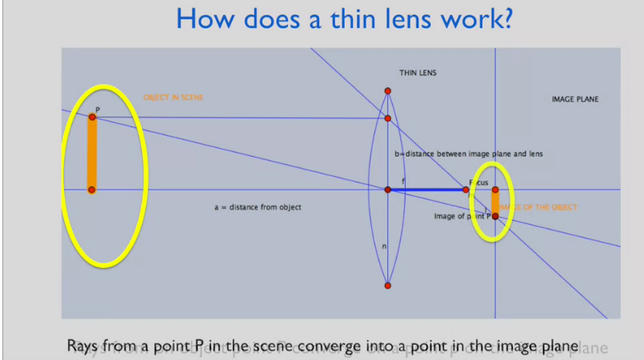

# Week 1: Geometry of Projection

## Camera modelling

- Different kinds of sensors: ladybug (array for panoramic views), kinect, laser scanner, stereo camera

### Camera:
- 2 basic elements: (1) cmos imaging chip, (2) lens

#### Lenses
Lenses have a unique property to concentrate rays 

